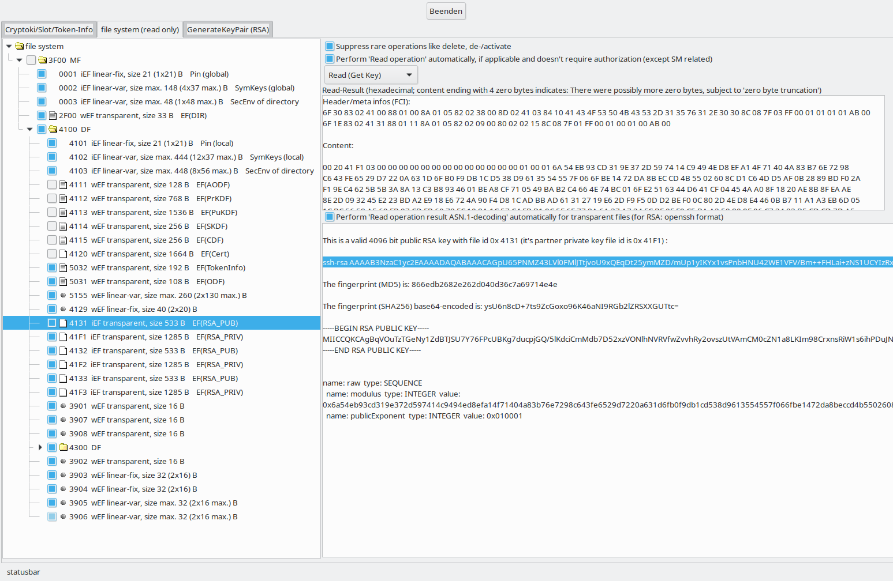

# acos5_64_gui
An Administration tool for ACS ACOS5-64 (v2: Smart Card/CryptoMate64 and v3: Smart Card/CryptoMate Nano), based on driver acos5_64 and acos5_64_pkcs15init for OpenSC.

For some of OpenSC's internal card drivers, there exist command-line tools. This is the GraphicalUserInterface tool for external driver acos5_64, built using the IUP GUI framework.

The repo is now based on a new driver implementation [acos5_64](https://github.com/carblue/acos5_64 "https://github.com/carblue/acos5_64") (since release v0.0.7). 

Next to libraries required according to dub.json, both of the following libraries are prerequisites being installed and OpenSC (opensc.conf) configured to use them:
[acos5_64](https://github.com/carblue/acos5_64 "https://github.com/carblue/acos5_64") and
[acos5_64_pkcs15init](https://github.com/carblue/acos5_64_pkcs15init "https://github.com/carblue/acos5_64_pkcs15init"). 
**The repo will always be closely related to the driver acos5_64 and acos5_64_pkcs15init development. Make sure to have the latest releases installed.**

Prerequisites required to be installed: 
Ubuntu: $ sudo apt-get update && sudo apt-get install opensc libtasn1-6
Other dependencies: 
Look at [IUP binding](https://github.com/carblue/iup "https://github.com/carblue/iup") for more details about IUP and installation. The required binaries are currently: 
Linux: libfreetype.so 
From IUP: 
                              Windows: freetype.dll and freetype.lib 
  Linux: libiup.so            Windows: iup.dll and iup.lib 
  Linux: libiupcontrols.so    Windows: iupcontrols.dll and iupcontrols.lib 
  Linux: libiupcd.so          Windows: iupcd.dll and iupcd.lib

From CD: 
  Linux: libcd.so             Windows: cd.dll and cd.lib

For Linux: install package `libtasn1-6` (providing libtasn1.so.6): for Windows, the required files are included in the [tasn1 binding](https://github.com/carblue/tasn1 "https://github.com/carblue/tasn1").

 
figure 1

 
figure 2

This is [WIP] work in progress

Features planned/about to be implemented:

- [x] View Cryptoki/Slot/Token-Info. 
- [x] View (, manipulate) the filesystem in a tree- and other views (with some obvious restrictions, e.g. resizing files is impossible with this card type). 
- [x] RSA keys/PrKDF/PuKDF handling. 
- [x] Sym keys/SKDF handling. 
- [ ] Pin/AOD handling. 
- [ ] Certificate/CDF handling 
- [ ] Export/Import file system 
- [ ] Initialize card 
...

The appearance of `acos5_64_gui` (visibility of tabs) depends on card content. E.g. if there is no MF, then there is no value in showing any tab except the one dedicated to creating an initial PKCS#15 file system. Or if there is no EF.SKDF file on the token, then the tab "KeySym (AES/3DES)" won't be accessible. All these checks take time and not all need to be done on each app invokation. The file `.acos5_64_gui` will be created in user's home directory on first invokation, in order to remember results of some of these checks. But this feature is evolving and implemented partially only, e.g. it doesn't currently recognise changes in check results. Therefore, if You feel something is wrong regarding that, for the time being delete everything for that card serial no. within `.acos5_64_gui` and save or delete `.acos5_64_gui`, and restart `acos5_64_gui` 

A short introduction to usage (by tab):

1. **Cryptoki/Slot/Token-Info**: All content is read-only: 2 GUI controls: A text window on the right with some info and a 2-colum matrix on the left: It's info shown is from calling: 
  C_GetInfo (information about the PKCS#11 (Cryptoki) implementing library used, opensc-pkcs11.so/dll/dylib in this case,  
  C_GetSlotList (information about how many slots with a smard card chip accessible where found: If there is no smart card/USB token plugged in, the application will shut down immediately, thus You won't see a 0 there. 1 token plugged in is the usual case and 1 slot should then show up there. Don't plug in more than 1 token: acos5_gui can't currently let You select which one to use from alternatives (TODO) and it's internal data structures are designed to hold info from 1 card/token only. 
  C_GetSlotInfo obtains information about a particular slot in the system. Slot is about the Reader. For USB tokens CryptoMate64 and CryptoMate Nano that's all except the built-in crypto chip and Token is about the crypto chip. 
  C_GetTokenInfo The info shown here is from different sources like among others file 0x5032 (TokenInfo_file) within the application's directory. acos5_gui is currently designed to handle 1 application only, automatically selected. The 'Token label' get's assembled by OpenSC from application's user's pin name and TokenInfo_file's label. 
  The line 'Token hardware version major.minor' tells about which smart card/USB token hardware version is currently connected, important for the next 2 lines: 
  The last 2 lines refer to FIPS (relevant for version 3 hardware only): The first line refers to the operation mode byte setting done during card initialization (or as default factory setting==FIPS mode) and the second line refers to whether the card detects itself as compliant to FIPS, which is possible only in operation mode==FIPS mode and when conforming to some other complex requirements detailed in the reference manual.
  Some of the driver's behavior depends on this, e.g. which RSA keyLength are allowed.

2. **file system**: All content is read-only currently: The info elements are a tree-view of the file system and 2 text panes, one for raw content, the other for displaying either RSA file details or decoded ASN.1 content. Click on a file/directory in the tree-view. If the file can't be read, only Header/meta infos (FCI) will be shown. You'll need knowledge from the reference manual to interpret that: It adds to the tree-view info what is missing there: The file access rights of currently selected file and it's enclosing DF: If there are any specified, they are after bytes 8C 08 7F and possibly for DF after AB. tree-view: The check-boxes aren't meant to be clicked, they just indicate, whether the file/directory is activated, i.e. the access rights control does or doesn't apply.
Most of the files are associated with a symbol, only a few are not: they are special, internal EF (iEF) files implicitely known by cos5: PinFile, File_with_keys_for_sym_algorithms (AES/3DES/DES) and the Security Environment File, all local to a DM/MF. The files with a bullet symbol are kind of private to the user: OpenSC won't touch/consult them, except for a file listing, as no path known to OpenSC leads to them. 
All other files have a 'sheet of paper' symbol and are in general accessible by OpenSC because they appear in some path info and are part of the PKCS#15 file structure (all ASN.1 encoded). The 2 different kinds are: Files that contain directory-like information (like AODF, PrKDF, PuKDF, CDF, SKDF, DIR, ODF) or have a special meaning for PKCS#15 like file 0x5032 (EF.TokenInfo). On the other hand files that are the leafs of the PKCS#15 file structure like Certificates (EF.Cert) and RSA files (EF.RSA_PUB and EF.RSA_PRIV). As an exception, the internal files (PIN, key_sym) don't apppear here as leafs: They are record-based and key_sym will be adressed by a record index (Pin.file is meant to have 1 record only) and they should be non-readable, usable only after a Login. 
All PKCS#15 relevant files except internal files (PIN, key_sym) are expected to be of file-structure 'transparent'. 
Security Environment File of directory should be readable without any restriction (without Login), but mindlessly ACS forces for V3 cards with FIPS-compliance to be readable only after some authentication, though the content is stipulated and publicly available. This case will be treated without reading the file. 
These files/file types are expected to be readable without any restriction (without Login): 
EF.DIR 
EF.ODF 
EF.TokenInfo 
All Directory files like PRKDF, PUKDF, PUKDF_TRUSTED, SKDF, CDF, CDF_TRUSTED, CDF_USEFUL, DODF, AODF 
This follows the philosophy of OpenSC to inspect a card for "general" information without requiring a Login. A Login is required only for those actions e.g. on files, that request it by there file meta data in file's header. Next to legitimation by a pin verification there is also authentication of a key possible in the near future (it's not yet implemented in the driver). The way this works is this: 

`acos5_64_gui` has code to inspect all files of the PKCS#15 file structure and to make sure, the content is PKCS#15 compliant and of type expected (as far as possible, because with OPTIONAL entries missing, there may be indistinguishableness). A failing detection is reported to stdout on Linux and visible by a bullet instead of a 'sheet of paper' symbol.

PS: 
For block cipher CBC deciphering the driver must compensate for a cos5 bug, which boils down to setting a correct IV vector for n-1 invocations of "7.4.3.7. Symmetric Key Decrypt". 
For OpenSC versions < 0.20.0 and block cipher CBC en-/deciphering the driver uses a fixed zero bytes Initialization Vector. 
Passing (arbitrary) IV with `sc_set_security_env` will be possible beginning from OpenSC version 0.20.0.

chronophage windows (using VS 2017) throws an unresolved symbol link error at me, one of the unpleasant ones unknown how to fix that and a google search points to a plethora of directions. It's long ago that I tolerated windows devour my spare dev time.

`acos5_64_gui` takes some time for start-up: A lot of card interaction occurs right in the beginning. Once the initial work is done and the GUI is reactive, there is only one other action, that takes remarkable time (freezing the GUI): RSA key generation with high bit sizes. CryptoMate64 takes about 3-5 minutes for a 4096 bit key pair generation and occasionally, the generation even fails. Just retry until that succeeds. The generation in existing files is available, but currently it's not possible to generate into RSA key pair files not yet existing.

There is no permanent connection to the card from `acos5_64_gui`, just on demand, but don't mix usages of `acos5_64_gui` (while it's accessing the card) with other card/token usages (that access the card), e.g. by Thunderbird, ssh or alike: I didn't yet investigate how the PKCS#11 library opensc-pkcs11 and the driver behave concerning multi-threading. 
With an USB token, card access is visible, but there are also "false" LED messages indicating card access: I assume something isn't perfect within the pcsc-lite layer, because sometimes, when I know the card access from `acos5_64_gui` is finished and the LED entered to a blinking state, it may continue to light up permanently without a sensible reason.
I'm used to stop that by invoking gscriptor from pcsc-tools, connect, disconnect and quit, possibly repeating that if required.

The regular case should be, that after about 1 minute of inactivity with `acos5_64_gui`, the USB LED should stop blinking, signaling it's unpowered state. 
While being inactive with `acos5_64_gui` (or only actions that don't access the card), any other app may be used that connects to the card. After closing that app, work with `acos5_64_gui` may be resumed. 
If You access a repo, e.g. GitHub via [ssh](https://help.github.com/en/articles/changing-a-remotes-url#switching-remote-urls-from-https-to-ssh "https://help.github.com/en/articles/changing-a-remotes-url#switching-remote-urls-from-https-to-ssh"), it may happen, that git starts to issue Cryptoki calls which ends in accessing the card periodically: That's a strange issue with respect to `git-upload-pack`. Somehow I managed to stop that. 
Also, don't plug-in more than 1 ACOS5-64 token simultaneously, or unplug or change the token while `acos5_64_gui` is running: `acos5_64_gui` is not yet designed to handle that (e.g. it memoizes the file system, assuming it's th same when resuming). 
The error handling is not complete at this stage: The problem with that is: The coding isn't easily done already and massive error handling code would currently obscure where the real action takes place. If You encounter any such situation, please report to issues.
